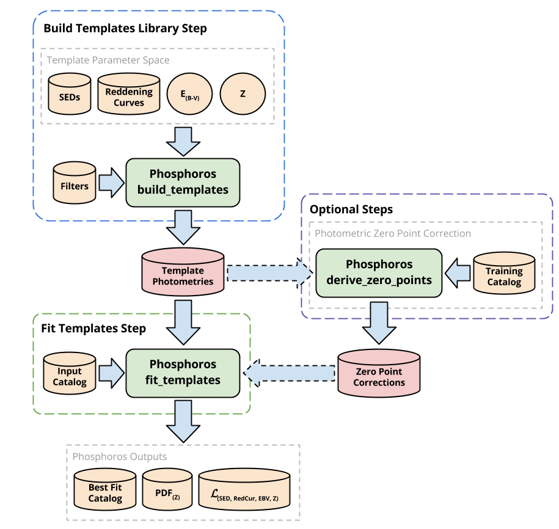
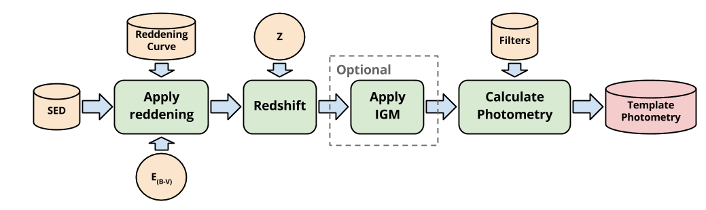

.. _first-steps:

***************************
First Steps with Phosphoros
***************************

Executing Phosphoros
====================

Instructions for installing Phosphoros can be found :ref:`here <phosphoros-install>`.

The Phosphoros software provides two different execution modes, the |CLI| which
allows execution from the command line, and the |GUI| which provides a graphical
interface for interactive execution.

Using the |CLI|
---------------

The |CLI| consists of the main entry command ``Phosphoros``. This command can
be used to execute all Phosphoros actions, using the following syntax::

   Phosphoros <action> <action_parameters>
   
The most important actions is the ``build_templates`` and the ``fit_templates``,
which perform the two mandatory steps of the Phosphoros software (as described
bellow). The full list of the available actions can be found :ref:`here <cli-actions-list>`.

Each action reads its input from a configuration file, which can be specified
with the action parameter ``--config-file=<path_to_file>``. Any of the options
in the configuration file can be overriden from the command line using
``--<option_name>=<option_value>``.

The full |CLI| reference, with a complete list of the action parameters, can be
found :ref:`here <cli>`, or by executing::

   Phosphoros help

Using the |GUI|
---------------

The |GUI| of Phosphoros provides a more user friendly alternative of the |CLI|.
Launching the |GUI| can be done from the command line, by executing the ``GUI``
action::

   Phosphoros GUI

The full |GUI| reference can be found :ref:`here <gui>`.

Workflow Overview
=================

The Phosphoros software is an implementation of a photometric redshift template
fitting method. Using the software consists of two mandatory steps, one which
prepares the library of the template photometries to perform the fitting with,
and one which perform the fitting itself, and a number of intermediate optional
steps (currently only the *Photometric Zero Point Correction* step).

The following diagram shows the Phosphoros workflow through these steps:

   

Build Templates Library Step
============================

The first step of Phosphoros is to build the library of the template
photometries to perform the fitting with. This step is obligatory, but it needs
to be performed only once for each set of template parameters. Its output can
then be reused when executing the *Fit Templates* step.

The command line action is the ``build_templates``, and the full description of
its parameters can be found :ref:`here <build_template_options>`.

Input description
-----------------

The inputs of the *Build Templates Library* step consist of the description of
the parameter space of the templates for which the fitting will be performed and
the filters for which the photometry of the templates will be calculated.

The *SEDs*, *Reddening Curves* and *Filters* are given to the software as files
containing tables (see :ref:`here <dataset_file_format>` for the file format
description). These files can be grouped in folders, which make the configuration
of the software easier. The most important |CLI| parameters related with these
inputs are the:

- :option:`sed-root-path <PhosphorosBuildTemplates --sed-root-path>` and
  :option:`sed-group <PhosphorosBuildTemplates --sed-group>`
  for selecting the SEDs
- :option:`reddening-curve-root-path <PhosphorosBuildTemplates --reddening-curve-root-path>` and
  :option:`reddening-curve-group <PhosphorosBuildTemplates --reddening-curve-group>`
  for selecting the Reddening Curves
- :option:`filter-root-path <PhosphorosBuildTemplates --filter-root-path>` and
  :option:`filter-group <PhosphorosBuildTemplates --filter-group>`
  for selecting the Filters

The *E*:sub:`(B-V)` and *Z* values are given as ranges or as value lists. The
most important |CLI| parameters related with these inputs are the:

- :option:`ebv-range <PhosphorosBuildTemplates --ebv-range>`
  for selecting the *E*:sub:`(B-V)` range
- :option:`z-range <PhosphorosBuildTemplates --z-range>`
  for selecting the *Z* range

Algorithm description
---------------------

The ``build_templates`` action builds the photometry of each template as shown
in the following diagram:

   
The optional step of the |IGM| can be controlled with the parameter
:option:`igm-absorption-type <PhosphorosBuildTemplates --igm-absorption-type>`.

Output description
------------------

The *Build Templates Library* step produces a single output file, which contains
the photometries of all the template parameter space. The |CLI| parameter for
selecting the output file is the
:option:`output-photometry-grid <PhosphorosBuildTemplates --output-photometry-grid>`
(see :ref:`here <photometry_grid_format>` for the file format description).

Note that this file follows an internal Phosphoros binary format, so it cannot
be used by other software. Phosphoros provides the action ``display_templates``,
which can be used for exploring this file. More details about how to use this
action can be found :ref:`here <display_template_options>`.

Photometric Zero Point Correction Step
======================================

The *Photometric Zero Point Correction* is an optional step, which can be used
for deriving the filter zero-point corrections based on a training catalog. The
related |CLI| action is the ``derive_zero_points``, and the full description of
its parameters can be found :ref:`here <derive_zero_points_options>`.

Input description
-----------------

The input of this step consists of the photometry library produced by the *Build
Templates Library* step and a training catalog, which contains both photometric
information and spectroscopic redshift. The |CLI| parameters for selecting these
files are the :option:`photometry-grid-file <PhosphorosDeriveZeroPoints --photometry-grid-file>`
and :option:`input-catalog-file <PhosphorosDeriveZeroPoints --input-catalog-file>`.

Phosphoros input catalog format is controlled via configuration options, which
define the format of the catalog and the mapping of its columns. The full
description of these options can be found :ref:`here <config-section-DZP-training>`.
A full description of the possible catalog formats can be found :ref:`here <catalog_format>`.

Algorithm description
---------------------

Phosphoros calculates the filter zero-point corrections using a loop. The loop
starts with no zero-point corrections and in each iteration the optimal
zero-point corrections are calculated, so the calculated PHZ matches the best
the spectroscopic redshift (which is assumed to be of higher quality). The loop
is terminated when a defined tolerance is reached (|CLI| parameter
:option:`phot-corr-tolerance <PhosphorosDeriveZeroPoints --phot-corr-tolerance>`)
or a maximum number of iterations is exceeded (|CLI| parameter
:option:`phot-corr-iter-no <PhosphorosDeriveZeroPoints --phot-corr-iter-no>`).

Output description
------------------

The zero-point corrections output file (defined with the
:option:`output-phot-corr-file <PhosphorosDeriveZeroPoints --output-phot-corr-file>`
|CLI| parameter) is a table containing the zero-point correction values for each
filter. Note that these values are **Flux** and not magnitude corrections. The
detailed description of the file format can be found :ref:`here <phot-corr-format>`.

Fit Templates Step
==================

The last step of using Phosphoros is the ``fit_templates`` action for estimating
the photometric redshift of the sources of a photometric catalog. The full
description of this actions |CLI| parameters can be found :ref:`here <fit-templates-options>`.

Input description
-----------------

The input of this step consists of the photometry library produced by the *Build
Templates Library* step, the zero-point corrections produced by the *Photometric
Zero Point Correction* step, and a catalog, which contains photometric
information. The |CLI| parameters for selecting these files are the
:option:`photometry-grid-file <PhosphorosFitTemplates --photometry-grid-file>`, the
:option:`photometric-correction-file <PhosphorosFitTemplates --photometric-correction-file>`
and the :option:`input-catalog-file <PhosphorosFitTemplates --input-catalog-file>`.

Phosphoros input catalog format is controlled via configuration options, which
define the format of the catalog and the mapping of its columns. The full
description of these options can be found :ref:`here <config-section-FT-input>`.
A full description of the possible catalog formats can be found :ref:`here <catalog_format>`.

Algorithm description
---------------------

For each source, Phosphoros calculates a likelihood grid containing the
likelihood of the source to match each template photometry in the library. This
is done by calculating the chi square between the source and the model
photometries. This multidimensional grid is used for selecting the best fitted
model (by selecting the cell with the highest likelihood value) and for producing
the 1D PDF of the photometric redshift (by marginalizing the grid).

Output description
------------------

Phosphoros software produces three types of output, which all are optional.

The first output is a catalog (enabled with the parameter
:option:`output-catalog-file <PhosphorosFitTemplates --output-catalog-file>`),
which contains the best fitted model of each source (selected as the cell with
highest value of the likelihood grid). The format description of this file can
be found :ref:`here <best-fit-catalog-format>`.

The second output is a FITS file which contains the PDF\ :sub:`(Z)` for all the
catalog sources (enabled with the parameter
:option:`output-pdf-file <PhosphorosFitTemplates --output-pdf-file>`). The format
description of this file can be found :ref:`here <pdf-fits-format>`.

The last output is the multidimensional likelihood
:math:`\mathcal{L}_{(SED, RedCurve, E_{(B-V)}, Z)}` for all the catalog sources.
These are saved as separate files in a directory set with the parameter
:option:`output-likelihood-dir <PhosphorosFitTemplates --output-likelihood-dir>`.
The format description of these files can be found :ref:`here <likelihood-fits-format>`.
*Note that the size of this output is quite big and it should be enabled only for
specific runs with small catalogs as input, otherwise it can easily fill your
hard drive.*

Due to the cmplexity of the likelihood output, Phosphoros provides a tool for
visualising it. This tool is the ``display_likelihood`` action. More details
about how to use this action can be found :ref:`here <display-ikelihood-options>`.